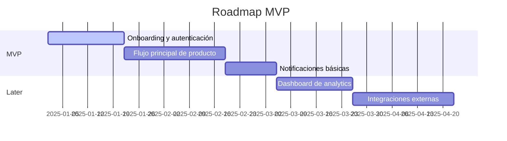

[‹ AI Playbook](/ai-playbook/README.md)
[‹ Discovery Phase](/ai-playbook/guides/discovery/README.md)

# Subphase #3 — Roadmap Definition

## Objetivo

Traducir research a prioridades de producto, recorte de MVP y secuencia inicial de trabajo.

Esta subfase no existe solo para listar features. Debe hacer visible:
- qué entra en MVP
- qué queda para later
- qué está fuera de alcance por ahora
- qué lógica sostiene esa priorización

---

## Skill principal

- `roadmap-definition`

---

## Inputs típicos

### Mínimo
- `product/RESEARCH.md`

### Recomendados
- `docs/PROJECT-SUMMARY.md`
- `management/RISKS.md`
- cierre de kickoff
- constraints comerciales o técnicos
- feature wishlist existente
- inputs de stakeholders

---

## Outputs y artefactos

### Canónicos
- `management/ROADMAP.md`
- actualización de `docs/PROJECT-SUMMARY.md`
- actualización de `management/RISKS.md`

### Muy recomendado
- `management/DECISIONS.md`

### Opcionales
- `product/artifacts/Feature-Prioritization.md`
- `product/artifacts/MVP-Cuts.md`

---

## Requisito importante del roadmap

`management/ROADMAP.md` debería combinar:

1. narrativa de prioridades y secuencia
2. tabla estructurada de features
3. visualización `Mermaid`

El objetivo no es solo registrar features, sino hacer comprensible el razonamiento del recorte.

### Ejemplo mínimo válido de diagrama Mermaid

El diagrama no necesita ser exacto en fechas. Lo importante es que muestre la secuencia, las dependencias y la separación entre MVP y later de manera visual.

---

## Qué debería dejar resuelto

- MVP vs later diferenciados con lógica visible, no solo por intuición
- features priorizadas con criterio explícito registrado
- dependencias y riesgos de secuencia documentados
- `scope-definition` puede arrancar con claridad sobre qué entra y qué no

---

## Criterio de cierre de la subfase

Roadmap Definition está cerrada cuando:
- `management/ROADMAP.md` existe y contiene las tres partes requeridas: narrativa de prioridades, tabla estructurada de features y diagrama Mermaid
- el diagrama Mermaid diferencia visualmente el MVP del `later` (secciones o etiquetas separadas)
- cada feature en la tabla tiene al menos: nombre, categoría (MVP / later / descartado) y criterio de prioridad o justificación breve
- la lógica de priorización está explicada en texto —no solo implícita en el orden de la tabla
- `management/DECISIONS.md` fue inicializado con al menos una decisión de producto tomada durante esta subfase
- las dependencias o riesgos de secuencia relevantes están registrados en `management/RISKS.md`
- `scope-definition` puede iniciar con suficiente claridad sobre qué entra en MVP y qué no
