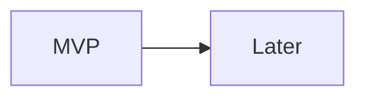

# Roadmap

## Product Goal
-

## Prioritization Principles
-

## MVP Scope
-

## Post-MVP / Later Opportunities
-

## Sequencing Logic
-

## Main Dependencies
-

## Open Prioritization Decisions
-

## Feature Table

| Feature Name | Release | Opportunity Statement | Target User | Requirements | Assumptions & Exclusions | Comparable Solutions | Reach | Impact | Frequency | Priority |
| --- | --- | --- | --- | --- | --- | --- | --- | --- | --- | --- |
| _Add feature_ |  |  |  |  |  |  |  |  |  |  |

## Roadmap Visualization

